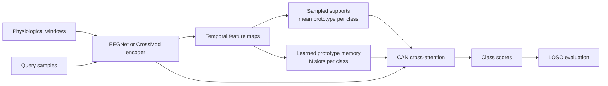

# FewShotPainAdaptation

Few-shot learning experiments for personalized pain assessment from physiological
signals. The repository trains Cross Attention Network (CAN) classifiers with
leave-one-subject-out (LOSO) evaluation on BioVid Part A, SenseEmotion, or
PainMonit-style NumPy data.

The current implementation supports:

- EEGNet-style joint-sensor feature maps
- CrossMod fusion for EDA/GSR and ECG
- Episodic classification with sampled class prototypes
- A learned prototype memory for support-free inference
- Held-out-subject k-shot evaluation and optional adaptation
- Source-subject prototype-vote evaluation

## Method Overview



An episodic task contains `K` labelled support samples and `Q` query samples per
class. In `can_support_mode=sampled`, the encoder produces a temporal feature map
for every support sample, then averages the maps within each class. CAN compares
each query with these class prototypes.

In `can_support_mode=learned_prototype_memory`, the model instead uses `N`
trainable prototype-map slots per class. Slot-level CAN scores are aggregated
into class scores with log-mean-exp. This mode supports inference without
labelled samples from the held-out subject.

The full LOSO workflow reports three related but distinct evaluations:

| Evaluation | References used for classification |
| --- | --- |
| Zero-shot | Learned prototype-memory slots only |
| K-shot | Labelled support samples from the held-out subject |
| Source-subject vote | Prototypes constructed from individual source subjects |

The full runner defaults to learned prototype memory with two slots per class.
The quick runner defaults to sampled class prototypes.

## Repository Structure

| Path | Purpose |
| --- | --- |
| `architecture/` | EEGNet, CrossMod, CAN, learned prototype memory, and the multimodal model |
| `data_loaders/` | Dataset configuration, loading, LOSO splitting, and episodic sampling |
| `learner/` | Training, evaluation, adaptation, checkpointing, diagnostics, and result recording |
| `tests/full_loso_trial.py` | Full LOSO command-line entry point |
| `tests/quick_fewshot_trial.py` | Short single-fold architecture and training probe |
| `scripts/` | Mock-data creation, BioVid conversion, analysis, and plotting utilities |
| `main.ipynb` | Colab-oriented BioVid Part A experiment notebook |

Important model modules are:

- `architecture/multimodal_proto_net.py`: top-level CAN classifier
- `architecture/crossattention_module.py`: temporal cross-attention and
  similarity calculation
- `architecture/learned_prototype_memory.py`: trainable prototype-map slots
- `architecture/eegnet_style_encoder.py`: joint-sensor EEGNet-style encoder
- `architecture/crossmod_feature_map_encoder.py`: EDA/ECG CrossMod encoder

## Installation

The project uses Python, TensorFlow, and Keras. The current development
environment uses Python 3.12.

```bash
python3 -m venv venv
source venv/bin/activate
python -m pip install --upgrade pip
python -m pip install -r requirements.txt
```

`requirements.txt` pins `tensorflow==2.18.1` and includes
`tensorflow-metal`. The latter is specific to supported macOS environments and
may need to be omitted when installing on Linux or Windows.

## Data

### BioVid Part A

Set `--dataset-source biovid_part_a`. The loader accepts either of these roots
under `--data-dir`:

```text
BioVid/PartA/
PartA/
```

Each root must contain:

```text
Train/<MODALITY>/<SUBJECT>_data.npy|npz
Train/<MODALITY>/<SUBJECT>_label.npy|npz
Test/<MODALITY>/<SUBJECT>_data.npy|npz
Test/<MODALITY>/<SUBJECT>_label.npy|npz
```

Select exactly two modalities with `--modalities`; BioVid accepts `ECG`, `EMG`,
and `GSR` (`EDA` is an alias for `GSR`). BioVid Part A uses its predefined
train/test split: training tasks come from train subjects, while LOSO validation
and held-out evaluation operate over test subjects.

To convert BioVid arrays from `.npy` to compressed `.npz`:

```bash
python scripts/convert_biovid_parta_npy_to_npz.py --help
```

### SenseEmotion

Set `--dataset-source senseemotion`. The loader accepts either of these roots
under `--data-dir`:

```text
SenseEmotion/
```

The tree must contain the same predefined split layout as BioVid:

```text
Train/<MODALITY>/<SUBJECT>_data.npy|npz
Train/<MODALITY>/<SUBJECT>_label.npy|npz
Test/<MODALITY>/<SUBJECT>_data.npy|npz
Test/<MODALITY>/<SUBJECT>_label.npy|npz
```

SenseEmotion accepts `ECG`, `EMG`, `GSR`/`EDA`, and `RSP`; exactly two must be
selected. It uses sequence length `1664` and four raw classes `0,1,2,3`. In
Colab, put `sense_emotion.tar.gz` under
`/content/drive/MyDrive/PainData`; the notebooks stage and extract it with the
same safe archive helper used for BioVid.

### PainMonit-Style Arrays

Set `--dataset-source painmonit`. The data directory must contain:

```text
X_pre.npy
y_heater.npy
subjects.npy
```

The loader also accepts `.npz` equivalents. Features are expected as
sample-major physiological windows, labels as class IDs or one-hot rows, and
subjects as one subject ID per sample.

Create compatible mock arrays with:

```bash
python scripts/create_mock_pain_dataset.py
```

The mock files are named `X_pre_mock.npy`, `y_heater_mock.npy`, and
`subjects_mock.npy`; select them with `--data-variant mock`.

## Running Experiments

Run commands from the repository root.

### Quick BioVid Probe

`quick_fewshot_trial.py` runs one fold and uses the BioVid Part A configuration.
It defaults to sampled class prototypes.

```bash
python tests/quick_fewshot_trial.py \
  --data-dir data \
  --updates 2 \
  --task-batch-size 2 \
  --train-eval-tasks 2 \
  --val-tasks 2 \
  --heldout-tasks 2 \
  --k-shot 2 \
  --q-query 2
```

Use `--can-support-mode learned_prototype_memory` to probe the learned bank
instead.

### Mock End-to-End Smoke Run

After generating mock data, use the full runner with one fold:

```bash
python tests/full_loso_trial.py \
  --data-dir data \
  --dataset-source painmonit \
  --data-variant mock \
  --encoder-backend eegnet \
  --can-support-mode sampled \
  --k-shot 2 \
  --q-query 2 \
  --num-epochs 1 \
  --tasks-per-epoch 2 \
  --task-batch-size 2 \
  --val-tasks 2 \
  --heldout-eval-tasks 2 \
  --max-folds 1 \
  --disable-window-shift \
  --output-json outputs/full_loso/smoke_results.json
```

### Full LOSO Run

The full runner defaults to BioVid Part A, CrossMod, learned prototype memory,
two prototype slots per class, and source-subject prototype voting.

```bash
python tests/full_loso_trial.py \
  --data-dir data \
  --dataset-source biovid_part_a \
  --encoder-backend crossmod \
  --can-support-mode learned_prototype_memory \
  --learned-prototype-slots-per-class 2 \
  --k-shot 10 \
  --q-query 10 \
  --num-epochs 1 \
  --tasks-per-epoch 20000 \
  --task-batch-size 16 \
  --val-tasks 50 \
  --heldout-eval-tasks 500 \
  --output-json outputs/full_loso/full_loso_results.json
```

For SenseEmotion, use:

```bash
python tests/full_loso_trial.py \
  --data-dir data \
  --dataset-source senseemotion \
  --task-class-ids 0,1,2,3 \
  --encoder-backend crossmod \
  --can-support-mode learned_prototype_memory \
  --k-shot 10 \
  --q-query 10 \
  --num-epochs 1 \
  --tasks-per-epoch 20000 \
  --task-batch-size 16 \
  --val-tasks 50 \
  --heldout-eval-tasks 500 \
  --output-json outputs/full_loso/senseemotion_results.json
```

For debugging, add `--max-folds 1`. To run a one-based inclusive fold range:

```bash
python tests/full_loso_trial.py \
  --data-dir data \
  --loso-start-index 1 \
  --loso-stop-index 5
```

Use `python tests/full_loso_trial.py --help` for the complete configuration
surface.

### Primary Matched-Query Personalisation Test

Enable the matched-query experiment on a full BioVid LOSO run with:

```bash
python tests/full_loso_trial.py \
  --data-dir data \
  --dataset-source biovid_part_a \
  --encoder-backend crossmod \
  --can-support-mode learned_prototype_memory \
  --normalize-mode split \
  --k-shot-adaptation-steps 0 \
  --k-shot 10 \
  --q-query 10 \
  --num-epochs 1 \
  --tasks-per-epoch 20000 \
  --task-batch-size 16 \
  --val-tasks 50 \
  --heldout-eval-tasks 500 \
  --matched-query-eval \
  --matched-query-support-repeats 500 \
  --matched-query-analysis-output-dir outputs/matched_query_personalization \
  --output-json outputs/full_loso/full_loso_matched_query_results.json
```

For each held-out subject, support is sampled from that subject's excluded
BioVid `Train` partition and all samples in its `Test` partition form one fixed
query set. Both conditions use normalization statistics fitted only on source
training subjects. The runner writes repeat-level metrics plus subject-level
paired statistics and support-sampling uncertainty.

## Configuration Notes

### Encoders

`--encoder-backend eegnet` applies one EEGNet-style encoder jointly to the
selected sensors. `--encoder-backend crossmod` builds one branch per selected
modality and fuses them with CrossMod attention. CrossMod requires CAN and two
sensors; this is enforced by `PainDatasetConfig`.

The `--eegnet-*` options configure the convolutional frontend used by both
backends. The `--crossmod-*` options configure only CrossMod attention and
fusion.

### Episodic Tasks

- `--task-class-ids` selects raw dataset labels, for example `0,4`.
- `--k-shot` and `--q-query` set samples per class.
- `--task-construction-mode` supports `single_subject`, `cross_subject`, and
  `mixed`.
- `--normalize-mode` supports `support`, `subject`, `split`, and `none`.
- `--task-chunk-size` controls how many tasks share one encoder forward batch.

### Prototype Memory

- `--can-support-mode sampled` uses class means from each task's support set.
- `--can-support-mode learned_prototype_memory` uses trainable slots.
- `--learned-prototype-slots-per-class` sets `N`.
- `--prototype-bank-init-samples-per-class` controls data-driven bank
  initialization.
- `--prototype-finetune-epochs` and
  `--prototype-finetune-tasks-per-epoch` control phase-two bank optimization.

### Evaluation and Reproducibility

- `--k-shot-adaptation-steps` optionally adapts on held-out support samples.
- `--validation-checkpoint-metric` and `--validation-checkpoint-mode` select the
  fold checkpoint.
- `--deterministic-ops` enables deterministic TensorFlow operations.
- `--seed` controls the run seed.
- `--disable-source-subject-prototype-vote` disables that auxiliary evaluation.

## Outputs

The full runner writes:

| Artifact | Contents |
| --- | --- |
| `outputs/full_loso/*.json` | Configuration, aggregate summary, and fold-level results |
| `outputs/training_progress/*_training_progress.csv` | Training, validation, phase-two, adaptation, and held-out events |
| `*_can_alignment_summary.csv` | Per-fold CAN true-class, competing-class, and margin summaries |
| `*_can_sample_statistics.csv` | Per-query predictions and CAN score diagnostics |
| `*_source_subject_prototype_vote_weights.csv` | Aggregated source-subject vote weights |
| `outputs/model_architecture/model_summary.txt` | Keras model and encoder summaries |

Useful tracked utilities include:

```bash
python scripts/convert_biovid_parta_npy_to_npz.py --help
```

Additional analysis scripts may be present in a research workspace, but only
tracked files should be treated as stable repository interfaces.

## Testing

Run the tracked contract and service tests with the standard library test
runner:

```bash
python -m unittest discover -s tests -p 'test_*.py'
```

The current suite contains 65 tests. `pytest` can also discover these tests when
installed, but it is not listed in `requirements.txt`.

For a lightweight syntax check:

```bash
python -m py_compile architecture/*.py data_loaders/*.py learner/*.py tests/*.py
```

## Research Caveats

- Sampled support classification represents each class by an arithmetic mean,
  so every support example contributes equal weight.
- A learned prototype bank is support-free at held-out inference, but it is not
  subject-specific unless adaptation or held-out support is introduced.
- K-shot results depend on support selection, normalization, and whether
  adaptation steps are enabled.
- Source-subject prototype voting is a separate inference strategy, not the
  learned prototype-memory result.
- LOSO comparisons should be reported across folds with uncertainty and paired
  statistical tests rather than interpreted from aggregate point estimates
  alone.
